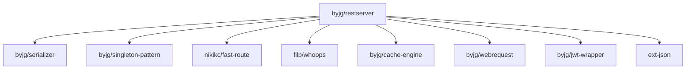

[](https://github.com/byjg/php-restserver/actions/workflows/phpunit.yml)
[](http://opensource.byjg.com)
[](https://github.com/byjg/php-restserver/)
[](https://opensource.byjg.com/opensource/licensing.html)
[](https://github.com/byjg/php-restserver/releases/)

# PHP Rest Server

Create RESTFull services with different and customizable output handlers (JSON, XML, Html, etc.).
Auto-Generate routes from swagger.json definition.

## Documentation

Setup:
- [Set up the RestServer](docs/setup.md)

Creating and customizing routes:
- [Defining Route Names](docs/defining-route-names.md)
- [Create Routes using Closures](docs/routes-using-closures.md)
- [Create Routes Manually](docs/routes-manually.md)
- [Create Routes using PHP Attributes](docs/routes-using-php-attributes.md)
- [Auto-Generate from an OpenApi definition](docs/autogenerator-routes-openapi.md) (**hot**)

Processing the request and output the response:
- [HttpRequest and HttpResponse object](docs/httprequest-httpresponse.md)

Advanced:
- [Middleware](docs/middleware.md)
- [Error Handler](docs/error-handler.md)
- [Intercepting the Request](docs/intercepting-request.md)
- [Output Processors](docs/outprocessor.md)
- [Caching Routes](docs/caching-routes.md)

## Installation

```bash
composer require "byjg/restserver"
```

## Dependencies



----
[Open source ByJG](http://opensource.byjg.com)

